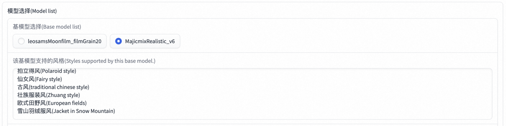
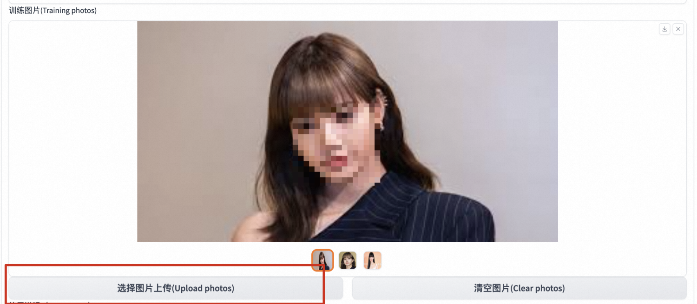
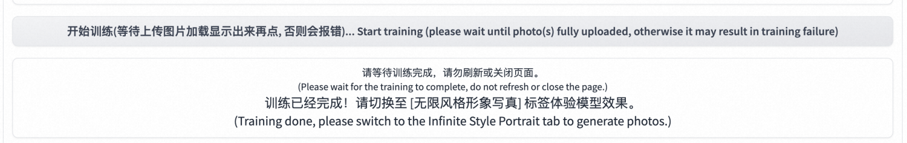
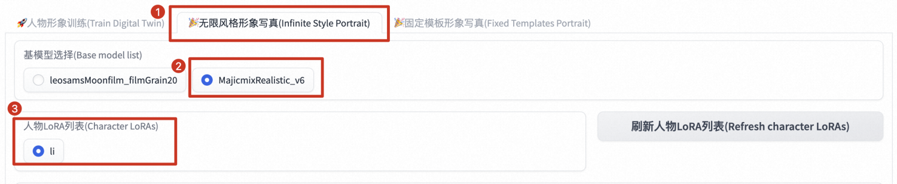
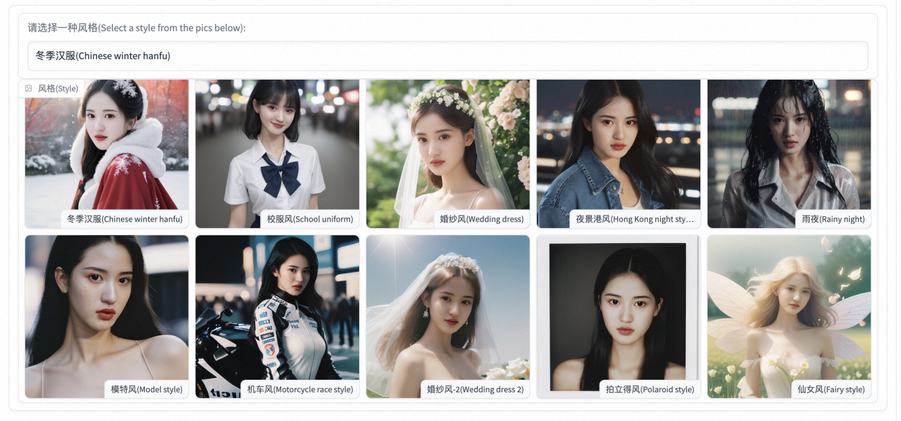
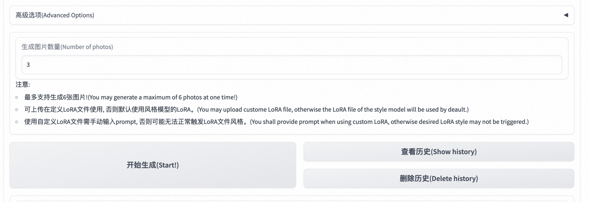
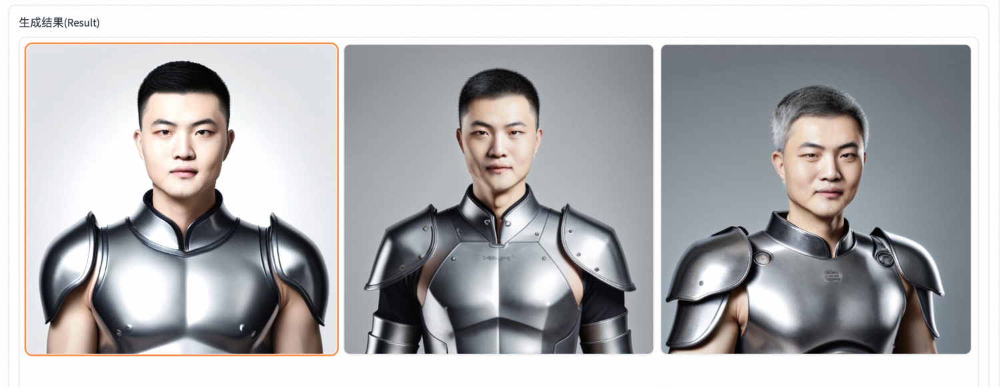
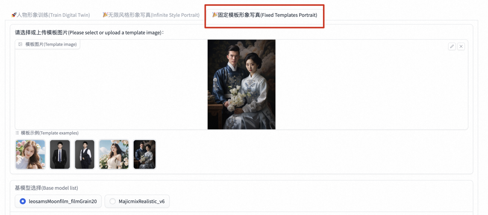
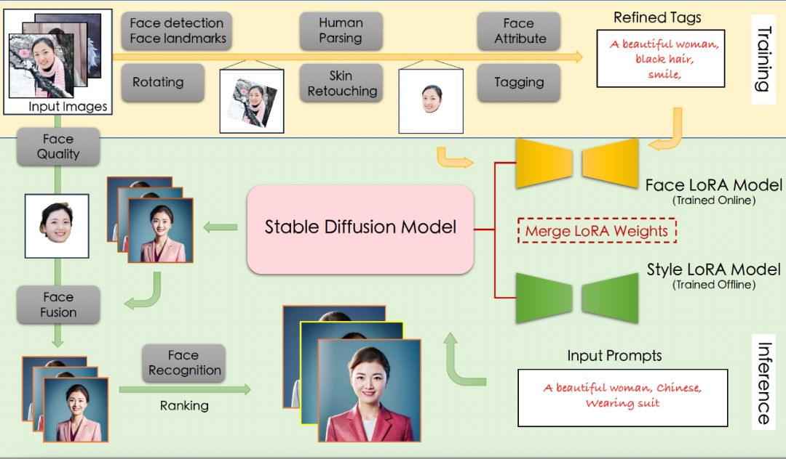

# 更新～～
- 新版本支持指
- 定风格定制
- 支持prompt和Negative Prompt优化
- 支持姿态控制
- 支持多人合照

目前支持的风格如下：

| 冬季汉服(Chinese winter hanfu) | 仙女风(Fairy style) |
| --- | --- |
| 校服风(School uniform) | 古风(traditional chinese style) |
| 婚纱风(Wedding dress) | 壮族服装风(Zhuang style) |
| 夜景港风(Hong Kong night style) | 欧式田野风(European fields) |
| 雨夜(Rainy night) | 雪山羽绒服风(Jacket in Snow Mountain) |
| 模特风(Model style) | 工作服(Working suit) |
| 机车风(Motorcycle race style) | 盔甲风(Armor) |
| 婚纱风-2(Wedding dress 2) | T恤衫(T-shirt) |
| 拍立得风(Polaroid style) | 汉服风(Hanfu) |
| 赛博朋克(Cybernetics punk) | 女士晚礼服(Gown) |
| 凤冠霞帔(Chinese traditional gorgeous suit) |  |

# 前言
都3202年了，再不拥有一套属于自己的个人数字形象就真的赶不上时代了❗️❗️❗️❗️ 如果你还不知道如何生成自己的个人数字形象，请让我来为你介绍： **FaceChain**——妙鸭相机的开源平替，可以用来打造个人数字形象的深度学习模型工具，仅需三张照片（划重点，仅需三张！！）即可生成属于你自己独有的个人数字形象替身，赶紧来[计算巢](https://computenest.console.aliyun.com/user/cn-hangzhou/recommendService)体验吧！ 话不多说，先看图！ 
 
 
 
 
 
 

# 服务创建
首先在[计算巢控制台](https://computenest.console.aliyun.com/user/cn-hangzhou/recommendService)找到FaceChain社区版，点击正式创建，或直接点击[这里](https://computenest.console.aliyun.com/user/cn-hangzhou/serviceInstanceCreate?ServiceId=service-0f4f642c994647cfbad8)。 
 

第二步选择资源部署的地域和实例规格，填写实例密码。 ⚠️注意，如果遇到实例规格列表为空的情况，可能是当前地域的库存不足，请切换其他地域重试！ 
 
第三步，填写软件登陆名和密码。⚠️**一定要记住自己的密码，否则后面无法登陆软件**⚠️ 
 
第四步，配置可用区和专有网络。 
 
第五步，点击“下一步：确认订单”跳转，勾选“我已阅读并同意《计算巢服务协议》”，点击立即创建。 
 
提交成功后点击去列表查看即可看到部署进度。 
 
等待状态变为“已部署”后，点击详情跳转到服务实例详情页。 
 
 
第六步，点击Endpoint，输入刚刚设置的用户名和密码即可登陆FaceChain界面开始创作啦！ 
 
# 形象定制
## 选择基础模型
首先选择感兴趣的基础模型，不同的基础模型包含的风格类型不同 
 

## 上传照片
第一步：输入当前人物名称，点击选择图片上传，为了保证质量，选择清晰的头肩照为宜。 
 
 

## 开始训练
第二步：在**上面图片全部加载出来后**，点击“开始训练”，然后就耐心等待吧～～～ 
 
直到输出信号出现“训练已经完成！”，这时候就可以愉快地进行下一步啦！！！
 

## 形象定制
第三步：生成形象！ 切换到“无限风格形象写真”tab，选择刚刚训练好的基础模型，找到你的人物LoRA。 
 
接着点击选择你喜欢的风格类型～ 
 
输入想要生成的图片数量，或者也可以在高级选项中进行各种高级操作～包括prompt优化，参数调整等等 
 
等待**生成完毕**后，即可获取自己的数字形象啦！ 
 

## 固定模版生成
切换到固定模版形象写真页面，可以根据指定模版生成您的数字写着，也可以在照片中添加多个人脸信息生成合照～ 
 

# 生成原理
AI 生成个人写真的能力来源于 Stable Diffusion 模型的文生图功能，即输入一段文本或一系列提示词，输出对应的图像。而影响个人写真生成效果的因素主要有两方面：写真风格信息和用户人物信息。 
 

## 训练阶段
训练阶段的输入是用户上传的包含清晰人脸区域的图像，输出是人脸 LoRA 模型。 
具体来说，首先使用基于朝向判断的图像旋转模型，以及基于人脸检测和关键点模型的人脸精细化旋转方法，来处理用户上传图像，得到包含正向人脸的图像；接下来使用人体解析模型和人像美肤模型，以获得高质量的人脸训练图像；随后，该项目使用人脸属性模型和文本标注模型，结合标签后处理方法，产生训练图像的精细化标签；最后使用上述图像和标签数据微调 Stable Diffusion 模型得到人脸 LoRA 模型。
## 推理阶段
推理阶段的输入是训练阶段用户上传图像和预设的用于生成个人写真的输入 prompt，输出是个人写真图像。 在推理阶段，该项目首先将人脸 LoRA 模型和风格 LoRA 模型的权重融合到 Stable Diffusion 模型中；接下来使用 Stable Diffusion 模型的文生图功能，基于预设的 prompt 初步生成个人写真图像；随后，该项目使用人脸融合模型进一步改善上述写真图像的人脸细节，其中用于融合的模板人脸通过人脸质量评估模型在训练图像中进行挑选；最后再使用人脸识别模型计算生成的写真图像与模板人脸的相似度，以此对写真图像进行排序，并输出排名靠前的个人写真图像作为最终输出结果。
# 总结
简单几步，即可在计算巢中生成一套属于自己的数字形象，如此简单、便捷的方案，快来计算巢一探究竟吧！
# 参考
FaceChain项目：[https://github.com/modelscope/facechain](https://github.com/modelscope/facechain) 机器之心报道：[https://mp.weixin.qq.com/s?__biz=MzA3MzI4MjgzMw==&mid=2650887719&idx=5&sn=040aeffa5c3b6ae1e5862912170e8a15](https://mp.weixin.qq.com/s?__biz=MzA3MzI4MjgzMw==&mid=2650887719&idx=5&sn=040aeffa5c3b6ae1e5862912170e8a15)
