# 前言
都3202年了，再不拥有一套属于自己的个人数字形象就真的赶不上时代了❗️❗️❗️❗️  
如果你还不知道如何生成自己的个人数字形象，请让我来为你介绍：
FaceChain——妙鸭相机的开源平替，可以用来打造个人数字形象的深度学习模型工具，仅需三张照片（划重点，仅需三张！！）即可生成属于你自己独有的个人数字形象替身，赶紧来计算巢体验吧！
# 服务创建
首先在[计算巢控制台](https://computenest.console.aliyun.com/user/cn-hangzhou/serviceInstanceCreate?ServiceId=service-47ede1ae16434ba39290)找到FaceChain社区版，点击正式创建。

第二步选择资源部署的地域和实例规格，填写实例密码。
⚠️注意，如果遇到实例规格列表为空的情况，可能是当前地域的库存不足，请切换其他地域重试！
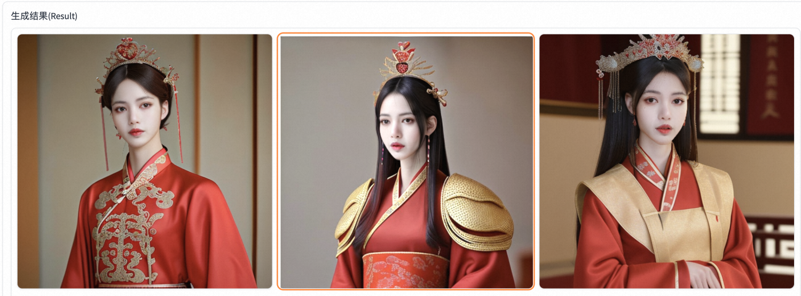
第三步，填写软件登陆名和密码。⚠️一定要记住自己的密码，否则后面无法登陆软件⚠️

第四步，配置可用区和专有网络。
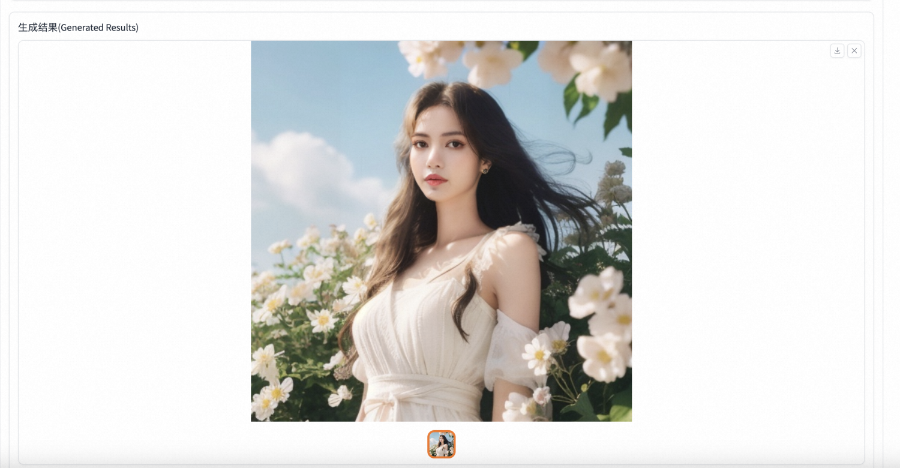
第五步，点击“下一步：确认订单”跳转，勾选“我已阅读并同意《计算巢服务协议》”，点击立即创建。
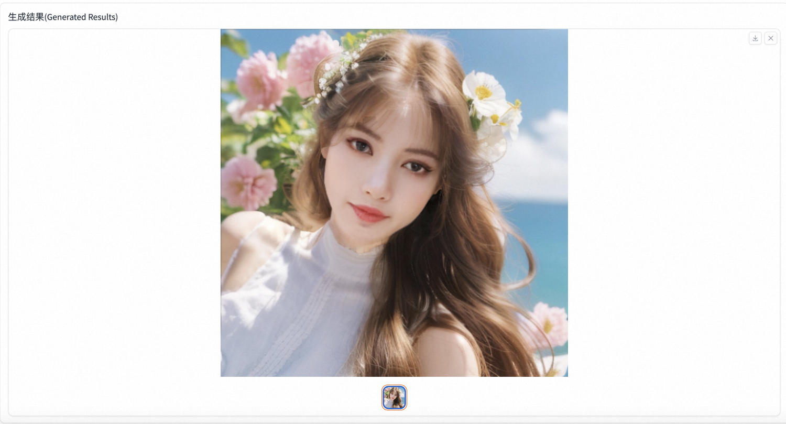
提交成功后点击去列表查看即可看到部署进度。
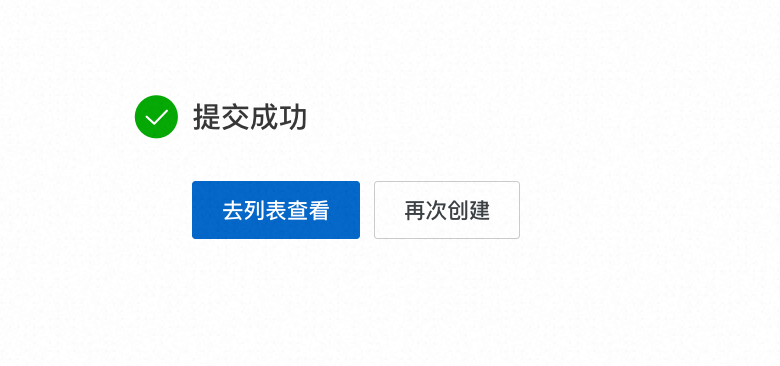
等待状态变为“已部署”后，点击详情跳转到服务实例详情页。

第六步，点击Endpoint，输入刚刚设置的用户名和密码即可登陆FaceChain界面开始创作啦！
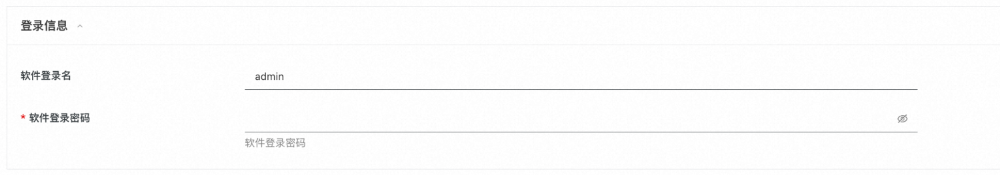
# 形象定制
## 上传照片
第一步：点击选择图片上传，请务必一次性选择多张图片同时上传，且为了保证质量，选择清晰的头肩照为宜。
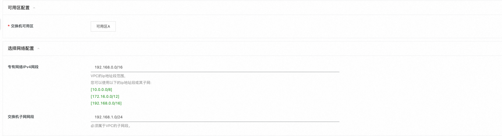
## 开始训练
第二步：在上面图片全部加载出来后，点击“开始训练”，然后就耐心等待吧～～～
这里由于后台会有下载模型和训练的过程，所以等待时间跟您的机器规格和所在地域有关，实测可能需要15-30分钟。但下载过一次之后下次再训练时就不需要下载了，只用等待几分钟就可以了！！！
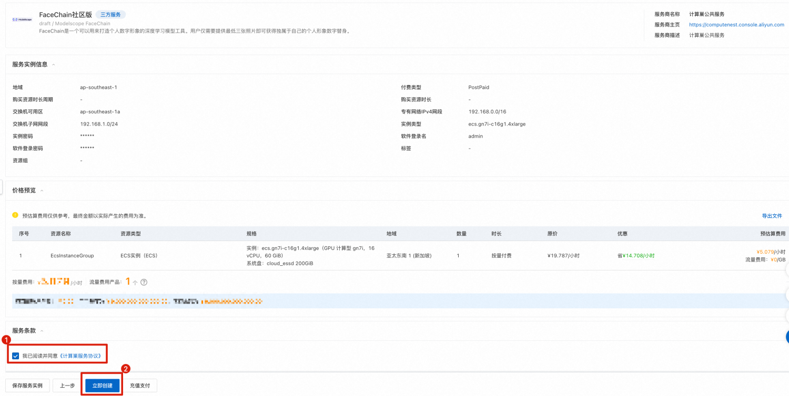
直到输出信号出现“训练已经完成！”，这时候就可以愉快地进行下一步啦！！！
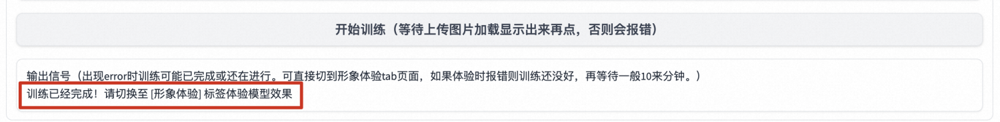
## 形象定制
第三步：生成形象！切换到“形象体验”tab，输入不大于6的生成图片数量（形象虽好，可不要贪多哦），点击“开始推理”，就可以开始期待自己的个人数字形象啦！
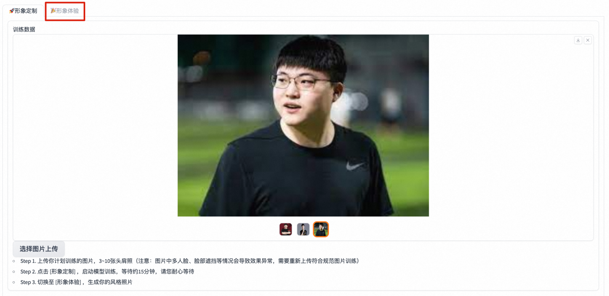
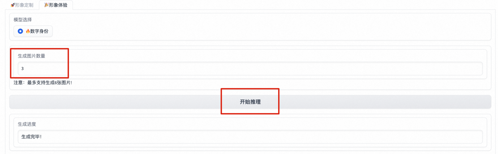
等待生成完毕后，即可获取自己的数字形象啦！
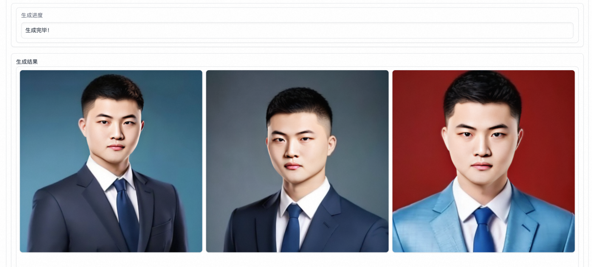
# 总结
简单几步，即可在计算巢中生成一套属于自己的数字形象，如此简单、便捷的方案，快来计算巢一探究竟吧！